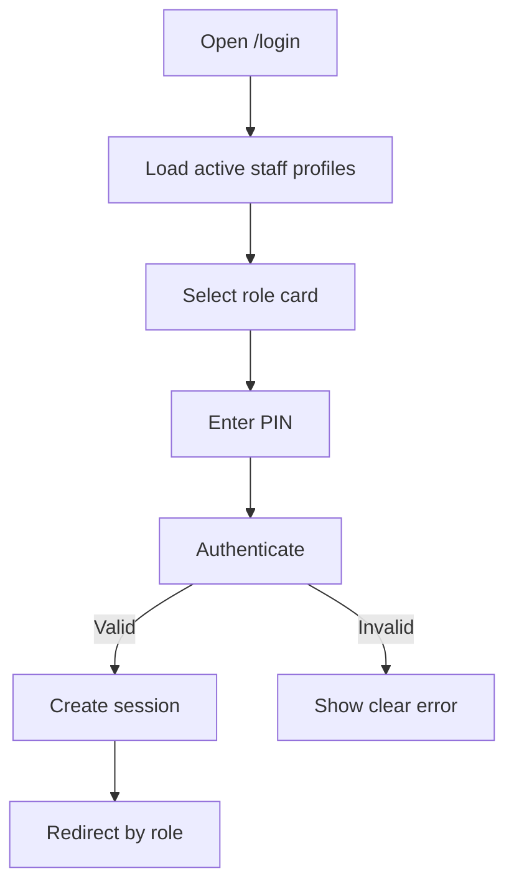
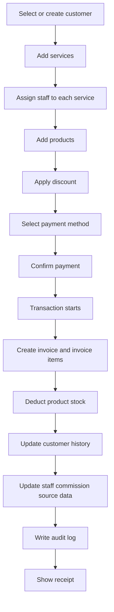
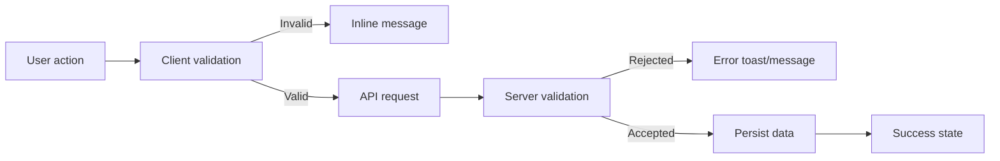

# Salon POS Application Flow

## Login Flow

## Role Routing Flow

- Admin routes to `/dashboard/admin`.
- Cashier routes to `/dashboard/cashier`.
- Barber routes to `/dashboard/barber`.
- Stylist routes to `/dashboard/stylist`.
- Beautician routes to `/dashboard/beautician`.
- Unauthorized dashboard access redirects to the correct role dashboard or returns a clean access-denied response.

## Admin Flow

1. Admin logs in with PIN.
2. Admin lands on the admin dashboard.
3. Admin can manage users, services, customers, billing, inventory, reports, reminders, settings, and staff performance.
4. Admin reviews revenue cards and staff leaderboard.
5. Admin creates or updates staff users and commission percentages.
6. Admin reviews reports and business insights.

## Cashier Flow

1. Cashier logs in with PIN.
2. Cashier opens billing.
3. Cashier selects an existing customer or creates a new customer during billing.
4. Cashier adds services.
5. Cashier assigns a barber, stylist, or beautician to every service.
6. Cashier adds products if needed.
7. Cashier applies a valid discount.
8. Cashier selects payment method.
9. Cashier confirms payment.
10. System generates receipt, saves bill, updates stock, updates customer history, and updates staff performance.

## Barber Flow

1. Barber logs in with PIN.
2. Barber lands on `/dashboard/barber`.
3. Barber sees today, week, month, and lifetime metrics.
4. Barber reviews recent completed services, customers, invoice references, revenue, and commission.

## Stylist Flow

1. Stylist logs in with PIN.
2. Stylist lands on `/dashboard/stylist`.
3. Stylist sees personal service count, revenue, customers served, commission, and recent services.

## Beautician Flow

1. Beautician logs in with PIN.
2. Beautician lands on `/dashboard/beautician`.
3. Beautician sees beauty-service performance metrics and recent completed services.

## Billing Flow

Billing validation:

- At least one service or product is required.
- Every service requires staff assignment.
- Product quantity must be positive.
- Stock cannot go negative.
- Discount cannot be negative or exceed allowed limits.
- Amount paid must cover total unless split payment is supported.

## Customer Flow

1. Staff searches by name or phone.
2. Staff creates or edits customer details.
3. Billing automatically creates a customer if a phone is supplied.
4. After billing, total visits, total spending, favorite services, preferred staff, and customer category update.
5. Admin can identify new, returning, VIP, frequent, and high-value customers.

## Inventory Flow

1. Admin or cashier views products.
2. Authorized staff adds or edits product data.
3. Stock in and stock out movements update current stock.
4. Billing product sales create sale movements.
5. Low stock alerts appear when current stock is at or below threshold.
6. Negative stock is blocked.

## Reports Flow

1. Admin opens reports.
2. Admin selects date range where available.
3. Server aggregates revenue, bills, services, product sales, staff performance, customer activity, low stock, commissions, and payment methods.
4. Dashboard shows summary cards, clean lists, and business insights.

## Navigation Flow

- Sidebar shows role-appropriate modules.
- Dashboard cards link to operational pages.
- Form buttons submit validated data.
- Cancel and close actions return users to the previous safe state.
- Logout clears the session and returns the user to login.

## Error Handling Flow

Errors should be clear, short, and written in salon-friendly language.
