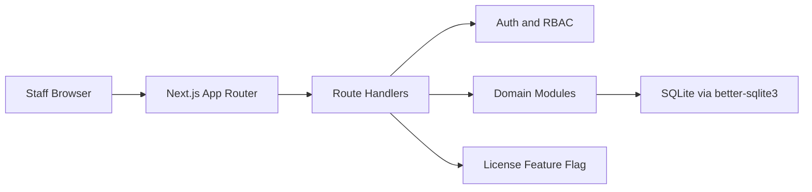
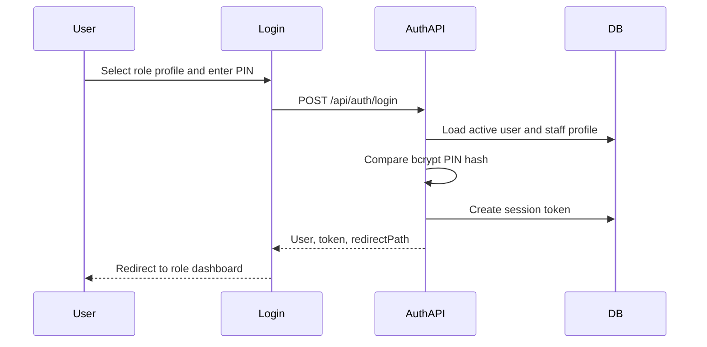
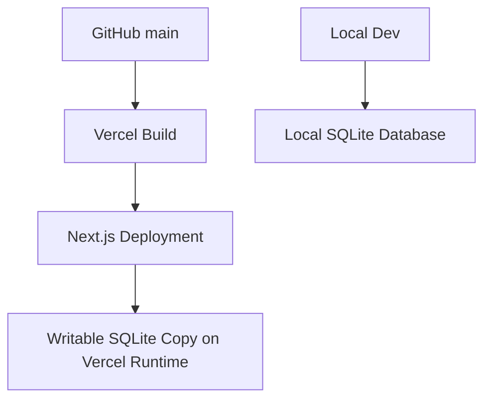

# Salon POS Technical Requirements Document

## System Architecture

Salon POS uses a modular Next.js architecture with route handlers for APIs, reusable UI components, and domain modules for business logic.



## Technology Stack

- Framework: Next.js App Router
- Language: JavaScript and TypeScript module types
- UI: React, Tailwind CSS, local reusable components, Lucide icons
- Database: SQLite with `better-sqlite3`
- Authentication: PIN/password hash with bcrypt and server-side sessions
- Runtime: Node.js
- Deployment: Vercel-compatible build plus local Node server option
- Quality: ESLint and Next.js production build

## Folder Structure

```text
src/
  app/
    api/
    admin/
    auth/
    dashboard/
    login/
  components/
    layout/
    ui/
  constants/
  lib/
    auth/
    db/
  modules/
    billing/
    customers/
    inventory/
    reports/
    services/
    staff/
  utils/
  proxy.js
```

Domain modules should contain types, validation, repositories, services, hooks, and components as the module grows. UI routes should call APIs or module services instead of owning complex business rules.

## Authentication Flow



During testing, demo PINs are visible on the login screen. Production can keep the same hashing/session architecture while hiding demo credentials and strengthening account policies.

## Role-Based Access

- Admin: all modules and analytics.
- Cashier: billing, customers, service/product selection, staff roster read for assignment, reminders.
- Barber: own performance dashboard and permitted service/customer views.
- Stylist: own performance dashboard and permitted service/customer views.
- Beautician: own performance dashboard and permitted service/customer views.

Protected routes are enforced by middleware/proxy checks and API-level `requireRole` checks.

## API Structure

- `/api/auth/login`: authenticate PIN and create session.
- `/api/auth/logout`: delete session.
- `/api/auth/verify`: verify session.
- `/api/users/active`: active role profiles for login.
- `/api/admin/services`: service CRUD.
- `/api/admin/billing`: bill history and bill completion.
- `/api/admin/customers`: customer CRUD and lookup.
- `/api/admin/employees`: staff/user CRUD and staff roster.
- `/api/admin/salon-products`: inventory product CRUD and stock movement.
- `/api/admin/reports`: business reports and insights.
- `/api/admin/staff-performance`: staff dashboards and admin leaderboard data.
- `/api/admin/settings`: salon settings.
- `/api/license/*`: isolated future license operations.

## Security Requirements

- Hash all PIN/password values with bcrypt.
- Store sessions server-side with expiry.
- Validate roles on every protected API.
- Validate and sanitize user input.
- Reject duplicate usernames.
- Reject inactive users.
- Reject negative stock, invalid discounts, and missing staff assignments.
- Keep environment variables server-side unless explicitly public.
- Keep license enforcement behind `NEXT_PUBLIC_LICENSE_ENABLED`.
- Use transactions for bill completion.
- Return clear error messages without exposing sensitive internals.

## Database Design Overview

Core persisted entities:

- Users and staff profiles.
- Sessions.
- Customers.
- Salon service categories and services.
- Salon bills and bill items.
- Salon products and inventory movements.
- Action logs.
- Settings/license metadata where enabled.

Billing is the central write workflow. It creates the bill, bill items, inventory movements, customer updates, and audit logs in one transaction.

## Deployment Architecture



Current testing deployments must not require activation. Set:

```env
NEXT_PUBLIC_LICENSE_ENABLED=false
```

Future commercial hosting can set:

```env
NEXT_PUBLIC_LICENSE_ENABLED=true
```

## Scalability Considerations

- Keep each business domain under `src/modules`.
- Move persistence into repositories as modules grow.
- Keep staff performance calculations centralized.
- Add appointments as a separate module, not inside billing.
- Add tenant/branch IDs to business entities before SaaS expansion.
- Add indexes for phone, bill date, staff ID, item type, and status fields as data grows.

## Performance Requirements

- Billing page should avoid full reloads during normal flow.
- Static service, product, and staff data should be cached safely on the client where useful.
- Dashboard queries should aggregate on the server.
- UI components should avoid unnecessary re-renders.
- Build output must stay Vercel-compatible.
- Slow network states should show loading and error feedback.
